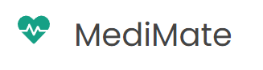
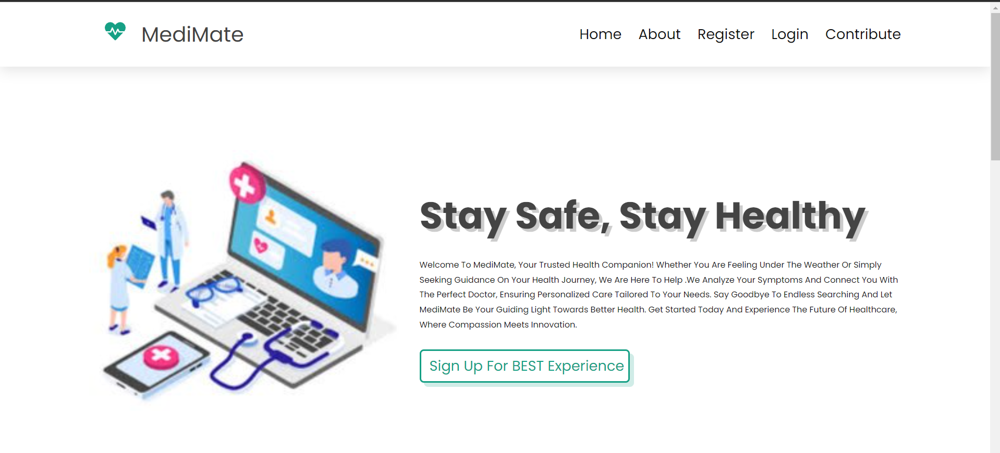

<a href="https://aimeos.org/">
    
</a>

# MediMate

## Overview

MediMate is your health-friend, here to guide you through your healthcare journey with care and understanding. Whether you're feeling under the weather or just need some advice, trust MediMate to help you always and also connect you with the right doctor at the right time. It is a go-to platform for analyzing your symptoms, matching you with the perfect doctor, and ensuring your health needs are met.

<p align="center"> 
  
</p>

## Table Of Content

- [Installation](#installation)
  - [Prerequisites](#prerequisites)
  - [Configuration](#configuration)
  - [Running a local server](#running-a-local-server)
- [TYPO3 setup](#typo3-setup)
  - [Database setup](#database-setup)
  - [Security](#security)
- [Page setup](#page-setup)
  - [Download the Aimeos Page Tree t3d file](#download-the-aimeos-page-tree-t3d-file)
  - [Go to the Import View](#go-to-the-import-view)
  - [Upload the page tree file](#upload-the-page-tree-file)
  - [Go to the import view](#go-to-the-import-view)
  - [Import the page tree](#import-the-page-tree)
  - [SEO-friendly URLs](#seo-friendly-urls)
- [License](#license)
- [Links](#links)

## Installation

### Prerequisites
You can follow these instructions to setup a dev environment:

- Install Node and Python in your system
- Clone this repo: `git clone https://github.com/insane-22/mediMate.git`
- Install dependencies:-
  - Frontend: `cd frontend && npm i`
  - Backend: `cd ../backend && npm i`
  - Flask Api `python install -r requirements.txt`
  - Notebook (Optional) `pip install -r requirements.txt`

### Configuration
Create a copy of config/config.json.example and rename it to config.json. You can do this by running this command from the mediMate directory:
```bash
cp backend/.env.example backend/.env
```
If you want to be able to sign-up and login, you will need to set up mongoDB database and change the `MONGO_URL` in .env just created. To get the mongoURL, create an id under MongoDB application and copy your user string to have a database for MediMate as well.

### Running a local server
In order to run the application locally, after having completed prerequisites, you need to follow these steps in parallel running terminals, from the mediMate directory for all 3 steps:

- Run the backend application: 

```bash
cd backend && npm run server
```
- Run the frontend application:

```bash
cd frontend && npm run dev
```
- Run the flask api application to be able to predict disease from symptoms, get their precautions and descriptions.

```bash
python main.py
```

After this, you can access the server at http://localhoost:3000, client application at http://localhost:5173 and flask api application at http://localhost:5000.

